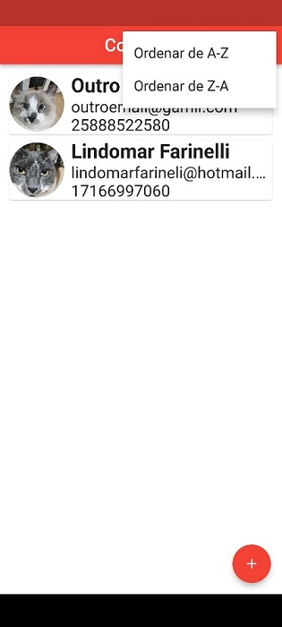
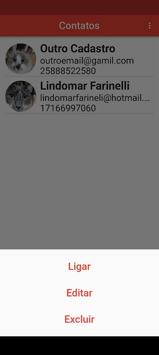

# Agenda de Contatos

​	Este é um projeto de estudos de como é possível utilizar um banco de dados interno do celular para armazenar dados de contatos do usuário.

​	Na pasta código, sob o título **agenda_contatos** está o código do aplicativo mobile que utiliza como tecnologias a linguagem _Dart_ por meio do framework _Flutter_ e o banco de dados relacional _Sqflite_.

​	Na pasta Outros haverá outros arquivos de pertinência do projeto, como por exemplo a imagem das telas e qualquer outra informação que seja relevante.

​	O projeto foi finalizado um aplicativo que possa armazenar, listar, excluir e editar contatos, além de guardar imagens dos contatos e ainda realizar as ligações para os números do telefone dos contatos diretamente a partir da agenda.

​	Abaixo uma amostra de como ficaram as telas, primeiramente a tela inicial.


Agora a alterando a posição da lista:




O que ocorre ao clicar sobre um contato:



E por fim, se desejar editar um contato:


​	Caso o usuário queira, tocando em ligar, é aberta a interface do telefone ou o registro é excluído quando toca-se em "excluir".

​	Obrigado por chegar até aqui!

​																	 **Lindomar Farineli**

 

```css

```


